# Floor Planner

**Version 1.2** — single source of truth: `APP_VERSION` in `floorplanner/config.py`
(also the JSON `FILE_VERSION`, currently 4, for the on-disk plan format — v4 adds
multi-floor plans). v1.1 = the package split + model layer; v1.2 = multi-floor
plans. The planning docs those versions targeted (`CODE_REVIEW.md`,
`REFACTOR_PLAN.md`, `TODO.md`) are tagged with the baseline version they target
and now live in `docs/superseded/`.

A 2D architectural floor-plan editor written in Python with PyQt6 — the
`floorplanner/` package (run `python FloorPlanner.py` or the `floorplanner`
console script), plus bundled fonts and artwork.

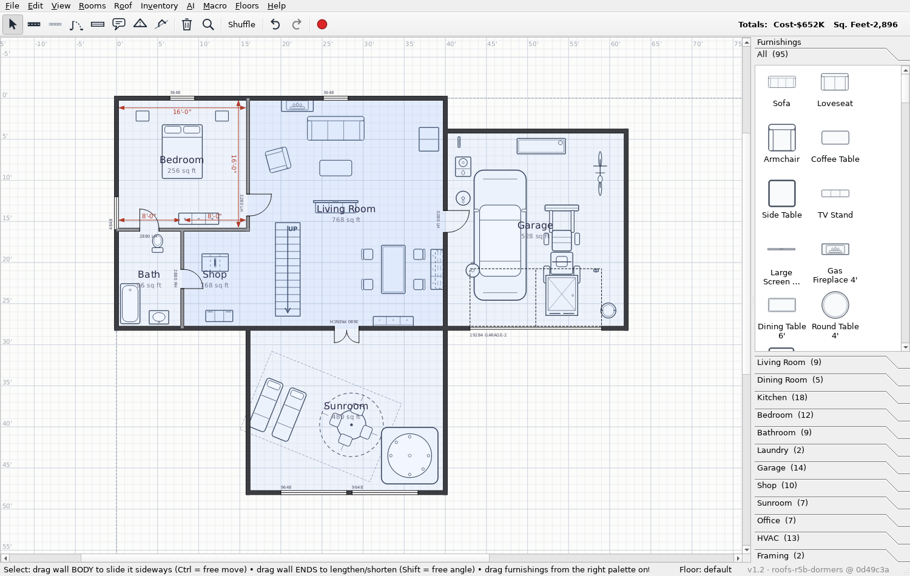

📸 **[Feature gallery](docs/gallery/)** — a screenshot per feature.

## Features

- **Walls** — exterior (6") and interior (4½") walls drawn by click-drag,
  orthogonal from the anchor (Shift for free angles). While drawing, the
  endpoint snaps to **line up with the projected line of a nearby
  open-ended wall** (a dangling end) while staying horizontal/vertical;
  fully-joined walls aren't snap targets and **nothing auto-grows** — any
  gap is left for you to close by hand. Shared endpoints join into mitred
  corners. Dragging a wall's body slides it orthogonally — attached walls
  stretch and shrink so rooms stay rectangular (Ctrl for free movement).
- **Doors & windows** — placed on a wall with WWHH sizes
  (`3280` = 32" × 80"), they cut the opening and ride the wall when
  dragged. Door types: LH, RH, bifold, pocket, slider, French, doorway,
  and single / double **garage doors** (shown as the opening plus a
  dashed overhead outline of the open door). When two rooms share a
  boundary (coincident walls), a door or window belongs to one wall and
  the wall next to it **opens** for it — a single clean opening, never two
  stacked on top of each other.
- **Rooms** — click inside any enclosed area to name it. The room traces
  its perimeter along the wall centrelines, computes the true interior
  area, can draw double-headed dimension arrows on every enclosing wall
  (opposite equal walls dimensioned once), and carries a property sheet
  (room type, ceiling, finishes, HVAC, notes…). A labelled room **owns its
  boundary walls**: left-drag the name to move the whole room — walls,
  doors and windows travel together — and on a shared boundary each room
  keeps its own wall, so adjacent rooms stay aligned without disturbing one
  another. Clicking a room's name or any of its walls brings that room to
  the front. Ctrl-drag the name to nudge just the label; stretch an
  individual wall to reshape the room as before. A room wall's end-knobs
  are locked while it belongs to the room — right-click it and **Detach
  wall from room** to unlock its corners (the wall stays part of the room).
  Drag a corner along the wall (Shift for any angle) and where it pulls
  away from its neighbour that side **opens**: the room keeps its shape and
  its area across the gap, so rooms no longer need a wall on every side.
  Slide that partly-open wall and the opening travels with it while both
  adjoining walls stretch; drag the wall back to the corners and the gap
  closes and the wall fuses back into the room (right-click to detach it
  again). An open side is **drawn dashed**, by the room itself, from the very
  outline edge that records it — no placeholder item, so the cue and the fact
  cannot disagree. Right-click a room name
  for an **inventory** — its
  properties plus every furnishing and opening in the room, in an aligned
  table you can copy as TSV for Excel. Rooms can be copied and pasted
  elsewhere with their walls and openings.
- **Furnishings** — a bundled CC0 library of 95 top-view symbols across
  **Living** (sofas, chairs, tables, TV stand, **large-screen TV**, **gas
  fireplace**, bookshelf), **Dining** (tables, chairs, **buffet**, **china
  hutch**), **Kitchen** (appliances, sink, standard
  **base
  cabinets** — 24"/36" door bases, drawer base, sink base, corner
  lazy-susan — 24"/30"/36" **wall cabinets** (drawn dashed, overhead),
  18"/24"/36" **pantry cabinets**, and **islands** (a 6' island and a 7'
  island with a sink, each with cabinets and a seating overhang),
  **Bedroom**, **Bathroom** (tub, shower, luxury walk-in shower, glass
  walk-in shower, toilet, and 24"/30"/36"/48" **vanity bases**), Laundry,
  **Office / Storage** (desk, **desk + chair set**, **L-shaped corner
  desk**, office chair, bookshelf, wardrobe), **Garage**
  (cars, boat + trailer, **sub-compact garden tractor with a front loader**,
  a **riding mower with a front snowblower**, workbench, yard equipment),
  **Shop** (table saw,
  lathe, jointer, drill press, bandsaw, planer…), **Sunroom** (swim spa,
  sauna, whirlpool, lounge chairs…), **HVAC** (gas/electric/oil
  furnaces, water heaters, water softener, gas/oil tanks, electric panel,
  car charger, battery wall, well pump, heat exchanger) and **Framing**
  (stairs, residential elevator). Drag one from the
  right-hand
  palette onto the plan and it lands at **true scale** (scene units are
  inches; a 16' SUV takes up 16'). The palette is organised in expandable
  room sections; placed items move with 1" snap and rotate via a grab
  handle (Ctrl = snap to the configured increment).
- **Stairs** — the Framing **stairs** symbol draws the right number of
  steps for the **ceiling height of the room it sits in** (standard ~7"
  risers) and shows an **UP / DN** travel arrow. Right-click it to switch
  between a **full flight** and a **half flight to a landing** that either
  ends at half height or **turns left / right**, and to flip the arrow up
  or down. Move it into a room with a different ceiling and the step count
  re-computes.
- **Groups & multi-select** — Ctrl+drag a rubber band to add items to a
  selection set, or Ctrl+click to toggle individual items. The rubber band
  only takes items it **fully encloses**, so you can lasso a single room
  without grabbing the party walls that run past it — and when a room's
  interior is enclosed, any edge carried by such a longer wall is copied so
  the room comes through as a complete, movable loop (the shared wall is
  left in place). Group the set (Ctrl+G) to move it as one unit — walls,
  furnishings and the rooms they enclose travel together — then ungroup
  (Ctrl+Shift+G) to drop everything in place. A selected group also has a
  **rotation handle**: drag it to spin the whole group about its centre
  (Ctrl snaps to the rotation increment), e.g. to re-orient a room. Groups
  can be cut, copied and pasted.
- **Room import / export (CSV)** — File ▸ Import / Export rooms… reads and
  writes `Name,Type,X_ft,Y_ft,X_loc_ft,Y_loc_ft,Notes`. Sizes and
  locations accept feet-and-inches (`12`, `12.5`, `12'6"`); rooms without
  a location auto-place on the first clear spot. Rooms that fall outside
  the canvas **grow it to fit** (up to 500'; larger values are rejected as
  typos). See [`examples/`](examples/) for sample files and previews.
- **Export to Chief Architect (DXF)** — File ▸ Export ▸ Chief Architect
  (DXF)… writes a purpose-built DXF R12 file (plus a sidecar) per storey
  level for Chief Architect X17's **CAD to Walls** importer, so a plan
  becomes native Chief walls, doors, windows and railings. See
  [below](#export-to-chief-architect-dxf) for the verified import workflow.
- **Room boolean operations** — select two rooms (Ctrl+click their names)
  and the **Rooms** menu treats their perimeters as polygons: *Combine*
  unions them (dropping the shared interior walls), *Intersect* keeps just
  the overlap, and *Subtract* removes the second room from the first. Each
  result is freshly walled and re-detected.
- **Fragment** — *Rooms ▸ Fragment* splits two overlapping rooms into three
  pieces — each room minus the overlap, plus the overlap itself — and puts
  **each piece in its own group with a complete set of walls** (shared
  edges get a wall per piece). So you can drag any fragment away and it
  stays a fully enclosed room while the others keep theirs. *Rooms ▸ Align
  to grid* snaps the selected rooms' walls to the wall-snap grid (keeping
  them orthogonal); *Rooms ▸ Distribute horizontally / vertically* spaces
  three or more selected rooms with equal gaps (the outermost two stay
  put); and *Rooms ▸ Refresh rooms* re-scans the canvas and drops any room
  whose walls have been moved away, clearing gray areas left behind.
- **Nudging** — arrow keys move the selected group or furnishing by the
  wall-snap step; hold Ctrl for a fine 1" step.
- **Undo / redo** — the **↺ / ↻** toolbar buttons (to the right of the
  zoom-fit magnifier, also **Ctrl+Z** / **Ctrl+Y**) step back and forward
  through every canvas operation — drawing and moving walls, openings,
  rooms, furnishings, groups, room boolean ops, nudges, deletes and pastes.
  History resets when you start a new plan or open one.
- **Inventory menu** — itemised, Excel-ready tables for the whole plan:
  *House* (rooms, doors, windows and walls), *Interior furnishings* and
  *Yard items* (furnishings split by location — cars, yard equipment and
  anything in the garage or outside the walls count as yard, each with
  quantities and AI-sourced prices), and *Total* (a summary with the grand
  building-plus-furnishings cost). Each opens as an aligned table; **Copy
  to clipboard (TSV)** emits tab-separated values that paste straight into
  a spreadsheet.
- **AI pricing** — the **AI** menu's *Update furnishing prices…* opens a
  dialog with a drop-down of AI systems (Anthropic Claude) and a fully
  editable, pre-filled prompt that asks for current US retail prices for
  the whole catalog. The reply (a JSON `{id: dollars}` map) is written into
  each furnishing's new `price` field in `manifest.json`, and palette and
  placed-item tooltips show the cost. The call uses your Anthropic API key
  (entered in the dialog — optionally remembered on this computer — or read
  from the `ANTHROPIC_API_KEY` environment variable).
- **Building totals** — the far right of the toolbar shows a live
  **Totals: Cost / Sq. Feet** label: the floor area of every room with
  *Include in total square footage* ticked (in its right-click Properties),
  priced at the cost per square foot set in Settings. Cost is shown in
  thousands; it updates as rooms are added, removed, resized, or toggled.
- **Settings** — File ▸ Settings… controls the wall snap (default 6" on
  centre), the rotation snap (default 15°), the canvas size (default
  100' × 70') and the building **cost per square foot** (default $150).
  Save with the **Save** button; all settings are stored with the plan.
- **Plans are plain JSON** — human-editable, documented in the module
  docstring: walls, openings, rooms, furnishings and settings, all lengths
  in inches.
- **Where files live** — **Help ▸ About** shows the app version and the
  OS-standard storage locations: plans open/save by default in
  `Documents/FloorPlanner`, and the app settings file (preferences,
  including a remembered AI key) lives in the standard per-user config
  directory (e.g. `%APPDATA%/FloorPlanner` on Windows, `~/.config/
  FloorPlanner` on Linux). Per-plan settings stay inside each plan's
  `.json`. Buttons in the dialog open either folder.

## Install & run

```bash
pip install -r requirements.txt
python FloorPlanner.py
```

Requires Python 3.10+ and PyQt6. Fonts (DejaVu) ship in `assets/fonts`,
so no system fonts are needed.

## Controls

| Action | How |
|---|---|
| Choose a tool | Toolbar icons or keys **S** E I D W R (Select / Exterior / Interior / Door / Window / Room) |
| Zoom / pan | Mouse wheel / drag empty space (middle-drag anywhere) |
| Draw a wall | Click-drag (Shift = free angle, Esc = cancel). Overlapping same-type walls within the snap grid **coalesce** into one shared wall (a boundary between two rooms is a single wall, not a duplicate); the drawn end **welds** onto a wall it lands on, forming a clean T/L joint |
| Stretch / slide a wall | Drag its end / body in Select mode. A dragged end sticks to the projected line of a nearby orthogonal wall (so you can close a corner) and grid-snaps otherwise; overlapping same-type walls coalesce on release. The end-grab zone is capped at a third of the wall, so even a short wall keeps a grabbable middle to slide perpendicular |
| Re-angle a wall end | Drag the end with **Shift** = free angle, or **Ctrl** = snap to 15° increments around the anchored end (build 45° and other off-axis walls) |
| Delete a wall | Right-click → *Delete wall* (or select + Delete). A wall on a room perimeter **fractures**: the room-edge stretch is kept, only the rest is removed; a wall bordering no room is deleted whole |
| Coalesce + weld on demand | **Edit ▸ Coalesce all walls now** merges overlaps and welds every T/L junction across the plan (toggle auto-coalesce in File ▸ Settings) |
| Place a door or window | Tool 4 / 5, click a wall, enter WWHH size |
| Name a room | Tool 6, click an enclosed area (one-shot; Ctrl-pick the tool to keep it) |
| Move a room (with its walls) | Drag the room name (Ctrl-drag = nudge the label only) |
| Detach a wall from its room | Right-click the wall → *Detach wall from room* |
| Lock the imported PNG backdrop | Right-click the image → *Lock image* (a padlock badge shows; locked images can't be moved, rescaled, cropped or removed — right-click → *Unlock image* to release) |
| Room dimensions / properties / inventory | Right-click the room name |
| Place furniture | Drag from the right palette onto the plan |
| Rotate furniture | Select it, drag the round handle (Ctrl = snapped) |
| Multi-select | Ctrl+drag a rubber band (encloses items / a room), Ctrl+click to toggle |
| Group / ungroup | **Ctrl+G** / **Ctrl+Shift+G** |
| Rotate a group | Select it, drag the rotation handle (Ctrl = snapped) |
| Nudge selection | Arrow keys (Ctrl = fine 1" step) |
| Room boolean ops | Select two rooms, use the **Rooms** menu |
| Plan inventories (TSV) | **Inventory** menu → House / Interior / Yard / Total |
| Update furnishing prices (AI) | **AI** menu → *Update furnishing prices…* |
| About / file locations | **Help** menu → *About FloorPlanner…* |
| Undo / redo | **Ctrl+Z** / **Ctrl+Y** (or the ↺ / ↻ toolbar buttons) |
| Cut / copy / paste | **Ctrl+X** / **Ctrl+C** / **Ctrl+V** |
| Import / export rooms (CSV) | File menu |
| Delete | Select + **Del** |
| Zoom to fit | **F** |
| Record / replay a macro | **Macro** menu (or the ● Record toolbar button) |

## Headless CLI / AI macro driver

The app can be driven with **no GUI** so a script or an AI system can edit a
plan, snapshot the canvas, and read back the result. It's a two-part tool:

- **In-app hook** — `MainWindow.run_macro(text)` plus `export_canvas`,
  `load_path`/`save_path` and `scene_summary` (the editor and the driver share
  the same code paths).
- **Driver** — `fp_macro.py`, a standalone CLI that boots the app offscreen,
  runs a macro, writes SVG/PNG snapshots, saves the plan, and prints a JSON
  summary of the layout.

A macro is a line of space-delimited tokens: menu/shortcut chords like `^C`
`^V` `^S`, distinct keyboard/mouse/arrow tokens (`CLICK x y`, `DRAG …`, `LEFT`,
`^UP`), and high-level placement (`PLACE sofa 120 96`, `WALL …`, `DOOR …`,
`ROOM "Living Room" 60 60`). Positions are in scene inches (1 unit = 1 inch).

```bash
python fp_macro.py --out den.json --svg den.svg --macro "
  WALL 0 0 240 0 ext  WALL 240 0 240 180 ext
  WALL 240 180 0 180 ext  WALL 0 180 0 0 ext
  ROOM Den 120 90  DOOR 120 0 3680  PLACE sofa 120 140 0"
```

The SVG snapshot (vector, AI-parseable) plus `--summary full` (the complete
`floorplanner-json` model) let a downstream AI *see* and *reason about* a change
before issuing the next macro. Full token reference:
[`docs/macro_language.md`](docs/macro_language.md).

**Record macros in the GUI.** The **Macro** menu (or the ● Record toolbar
button) opens a non-modal recorder: click **Start**, interact with the plan
(draw walls, drop furnishings, copy/paste, nudge…), then **Stop**. Your
actions are written as macro tokens you can edit; select any portion and
**Replay** it, or **Save As…** a `.fpm` file to run later with `fp_macro.py`.

## Import a plan from a PNG

FloorPlanner can vectorise a raster floor-plan image into walls. It reads the
PNG (via `QImage`), detects the horizontal/vertical **wall** lines with numpy,
and scales pixels to inches — no OpenCV/Pillow needed.

**In the app:** **File ▸ Import from image (PNG)…** drops the picture on the
canvas as a translucent **backdrop** you can fit to the plan before extracting:
- **drag the body** to move it, **drag a corner** to scale it roughly;
- **right-click ▸ Calibrate scale…** then click two points a known distance
  apart and type that distance — the image auto-scales to match (the precise
  way to set scale);
- **right-click ▸ Crop to region** to drag-select just the area you want;
- **right-click ▸ Extract walls** detects the walls and shows them as a **blue
  ghost overlay** — click **Yes** to add them, **No** to discard. Then
  **right-click ▸ Remove image**.

**From the command line:** `fp_extract.py` writes a `floorplanner-json` file
(and an optional preview PNG):

```bash
python fp_extract.py --in plan.png --out plan.json --width-ft 40 --png out.png
```

Both target **clean, axis-aligned** line drawings (CAD exports, app
screenshots): dark walls on a light background. After importing, name rooms
(the app detects enclosed areas) and add doors/windows/furniture. Scale comes
from the real width (or `--px-per-ft`); double-line walls collapse with
`--merge <px>`. Diagonal walls and photos/scans are out of scope.

## Export to Chief Architect (DXF)

**File ▸ Export ▸ Chief Architect (DXF)…** writes one DXF R12 file (plus an
`.openings.json` sidecar) per storey level, purpose-built for Chief
Architect X17's **CAD to Walls** importer — the fastest way to get a
FloorPlanner design into Chief as *native* walls, doors, windows and
railings, rather than tracing over a picture. It is a zero-dependency
converter (`floorplanner/export/fp2dxf.py`, pure stdlib) validated
end-to-end against Chief Architect Premier X17 on a real two-storey plan;
doors, windows, rails, hinge handedness, per-level export and multi-floor
stacking all confirmed working.

```
FloorPlanner v5 design ──export──▶ <level>.dxf + <level>.openings.json
                                          │
                                          ▼   (per floor, in Chief)
                       Import Drawing wizard ▶ CAD ▸ CAD to Walls
                                          │
                                          ▼
                      native Chief walls / doors / windows / rails
```

Pick an output folder; the app writes every storey level (site/lot levels
are skipped) and shows a completion summary listing the files written and
any warnings (an opening that overran its wall, two openings overlapping on
one wall, a zero-length wall). Furnishings, reference images and dimension
annotations are **not** exported — FloorPlanner owns plan topology, Chief
owns construction build-up (platforms, roof, framing).

**Before exporting, check Edit ▸ "Wall orthogonality report…".** A wall
that is a fraction of a degree off axis draws as straight in FloorPlanner
but reads as a real angle to Chief's CAD to Walls importer — this is the
tool that tells you before Chief does.

### Why the export looks the way it does

- **Coordinates.** FloorPlanner is plan-inches, x-right, **y-down** (Qt
  scene); DXF is y-up, so every y is negated. The plan lands in negative-y
  in Chief — harmless, but **do not drag the imported CAD before
  converting** (it breaks multi-floor stacking, which relies on every level
  sharing the FloorPlanner origin).
- **Walls** are emitted as their two *face lines* (centreline ± half the
  wall's real thickness — read live from FloorPlanner's own per-type
  standards, never a copy), square-capped at the vertex projections. The
  schema's shared-vertex topology guarantees wall ends coincide, and Chief
  auto-joins converted walls at coincident ends, so miters are unnecessary.
- **Layers all carry an `FP-` prefix** (`FP-WALLS`, `FP-RAILS`, `FP-DOORS`,
  `FP-WINDOWS`, plus reference-only `FP-X-*` layers) so an imported layer
  can never case-insensitively merge with Chief's own native `Doors` /
  `Windows` layers — a real ambiguity, measured in testing, not a
  precaution taken on spec.
- **Doors need symbols, not just a gap.** Chief classifies an opening by
  its conventional drawing symbol; bare parallel gap lines read as a
  *window*. Hinged doors and gates emit a leaf line plus a 90° swing arc
  (from the schema's `hinge` / `swings_toward`, defaulting to `v1`/`left`
  when absent so classification never fails); sliders emit two overlapping
  half-width panels. Plain gap lines are kept for windows, which classify
  correctly as-is.
- **Concept rooms are quarantined.** Walls that serve only
  `category:"concept"` rooms go to the reference-only `FP-X-CONCEPT` layer
  and are never converted — matching FloorPlanner's own rule that concept
  rooms aren't part of the buildable plan.
- **Open room edges** (a side with no wall) draw dashed on
  `FP-X-OPEN-EDGE`; trace an Invisible wall over them in Chief so the room
  encloses (Chief needs a wall, even an invisible one, to bound a room).
- **The sidecar** `<level>.openings.json` carries what a DXF line can't:
  per opening id, its wall, kind, code, station span, sill/head height,
  door type, hinge and swing — the source of truth for the QC pass below.
  The same data rides on-plan as small magenta `FP-NOTES` text tags next to
  each opening.

### The verified Chief Architect X17 import workflow

**Follow this exactly — the settings below are traps whose wrongness stays
invisible until CAD to Walls silently does nothing.** Run it once per
level, on the matching Chief floor; use a fresh Chief plan for the first
import.

1. **File ▸ Import ▸ Import Drawing.**
   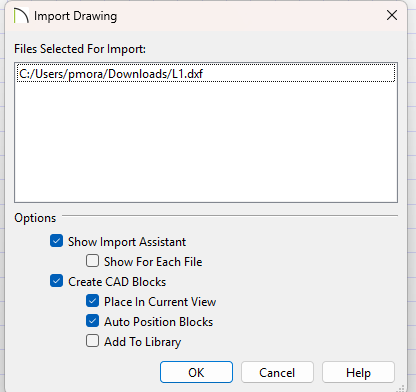
   **Show Import Assistant: ON** · Show For Each File: off ·
   **Create CAD Blocks: OFF** — critical: blocks hide the individual lines
   from CAD to Walls.
2. **Import Assistant — entity handling.**
   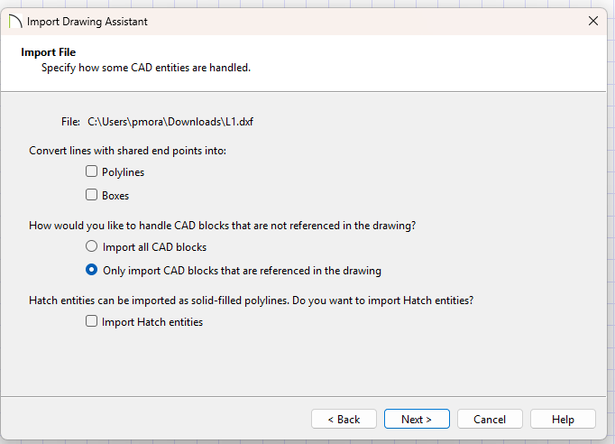
   Convert lines with shared end points into **Polylines: OFF, Boxes:
   OFF** — critical: wall faces share endpoints at every corner by
   construction and must stay discrete LINEs. CAD blocks option is
   irrelevant (the file contains none); Hatch: off.
3. **Select Layers.**
   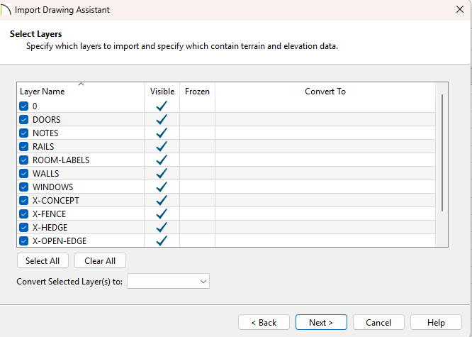
   Leave **all layers checked**; leave the *Convert To* column **empty**
   (it's for terrain elevation data only).
4. **Layer Mapping.**
   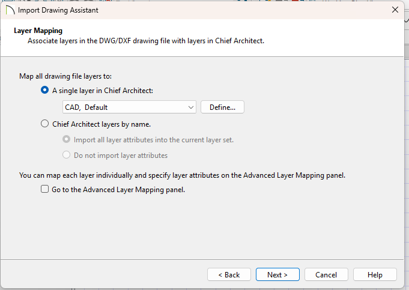
   Select **"Chief Architect layers by name"** with **"Import all layer
   attributes"** — this preserves the FP-* layers, colours and linetypes.
   (The default "single layer" flattens everything: wrong.)
5. **Drawing Unit.**
   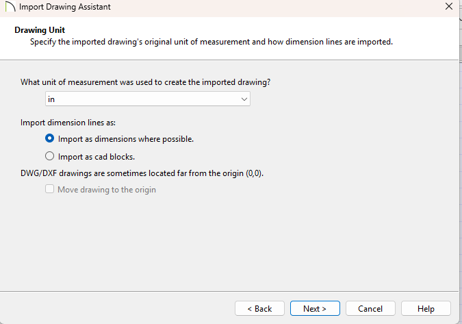
   Unit: **in**, drawing is 1:1. Dimension-line options are moot (the file
   contains none).

   After Finish, the drawing appears as coloured line work (black walls,
   red doors, blue windows, cyan rails):
   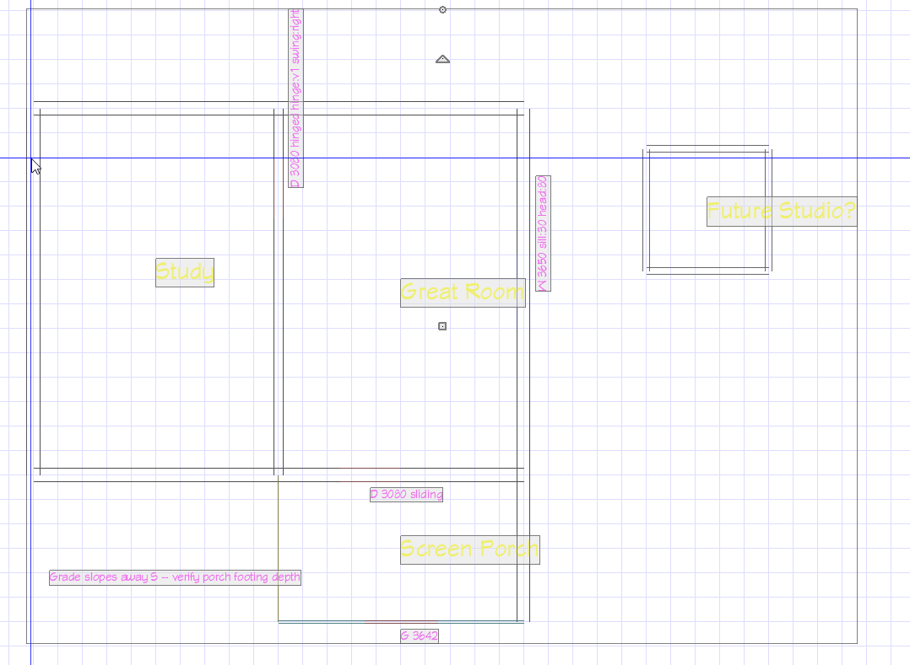
6. **CAD ▸ CAD to Walls… (Ctrl+F3).**
   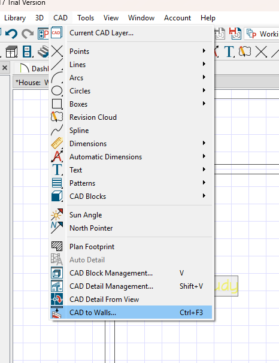
   The layer dropdowns list native and imported layers together — pick the
   **FP-** entries only:
   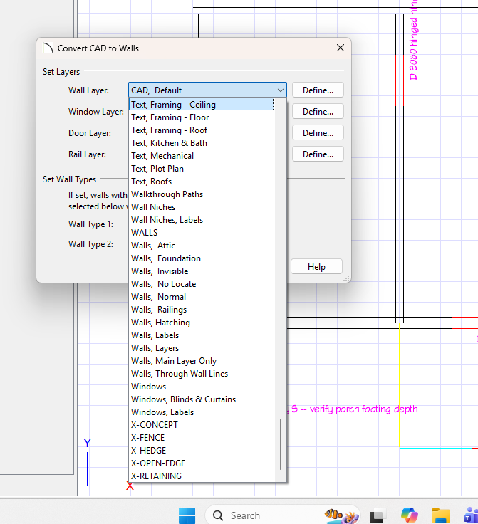

   | Slot | Layer |
   |---|---|
   | Wall Layer | FP-WALLS |
   | Window Layer | FP-WINDOWS |
   | Door Layer | FP-DOORS |
   | Rail Layer | FP-RAILS |

   Set Wall Types: **Wall Type 1 = Siding-6**, **Wall Type 2 =
   Interior-4** (Chief matches a line-pair spacing to a wall type within
   **±1 inch**, so exactness beyond that isn't required — agreement is).
   Never assign any `FP-X-*` layer. For the record, the first-session
   dialog below used the merged native `Windows`/`Doors` layers — with the
   FP- prefix this ambiguity no longer exists:
   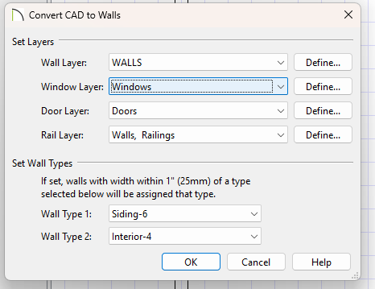
7. **Result.** The first-attempt failure mode that motivated the door
   symbols — both doors arrived as `2640DH` windows (correct width and
   station, wrong class):
   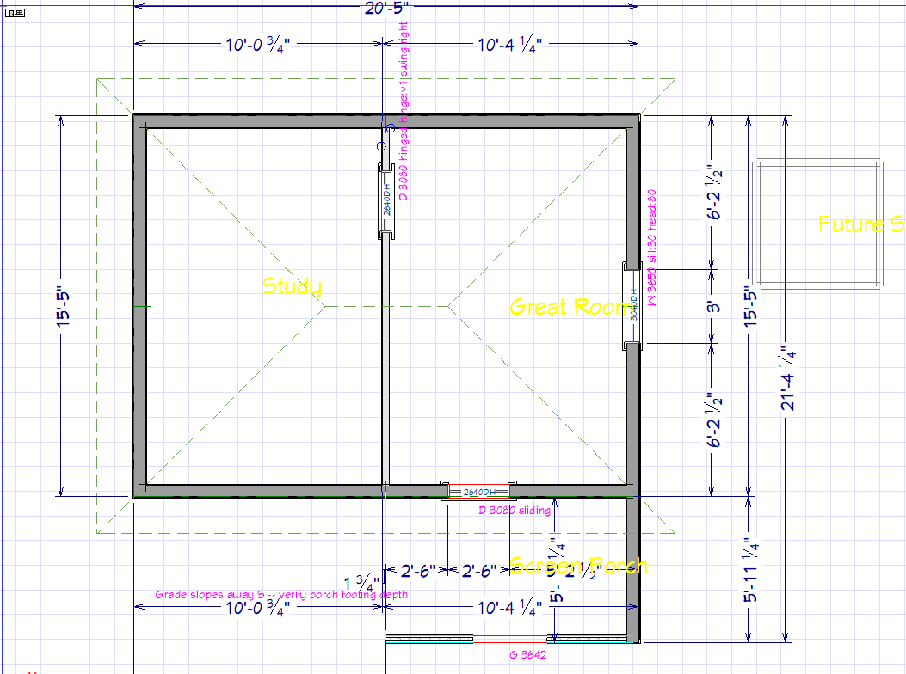

   Converted plan (walls, rooms, auto-dimensions, auto roof) and 3D:
   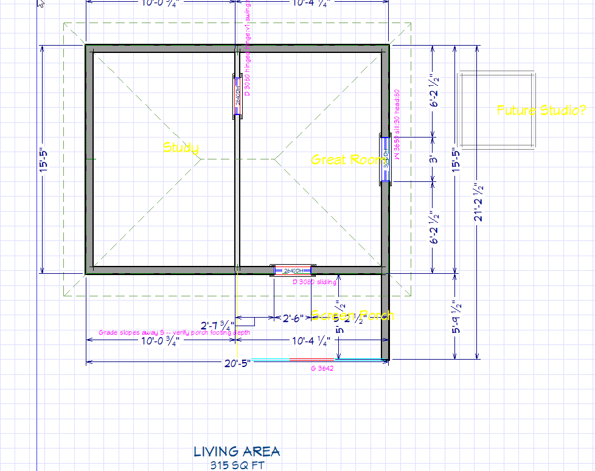
   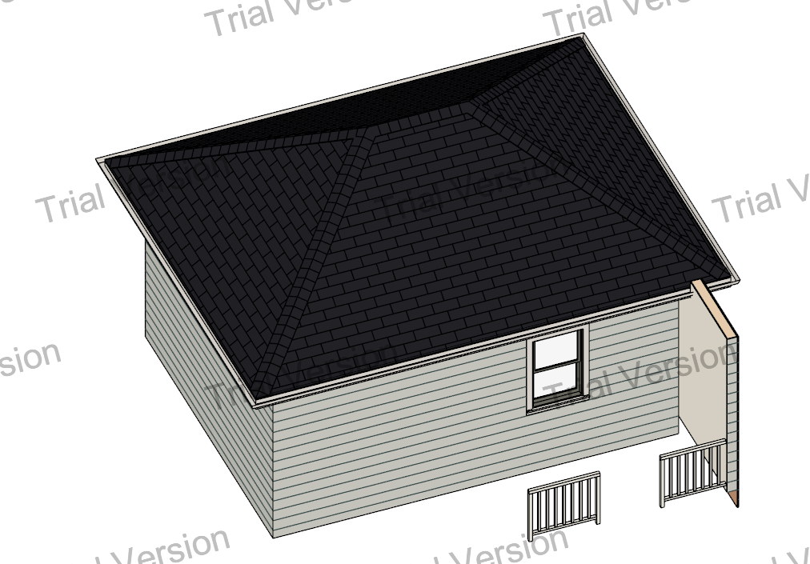

   Chief's auto dimensions measure to its own framing conventions and will
   not literally reproduce sidecar stations; the DXF geometry itself is
   exact. The dashed green perimeter and diagonals are Chief's auto hip
   roof (disable via Auto Rebuild Roofs if unwanted during QC).
8. **Additional floors.**
   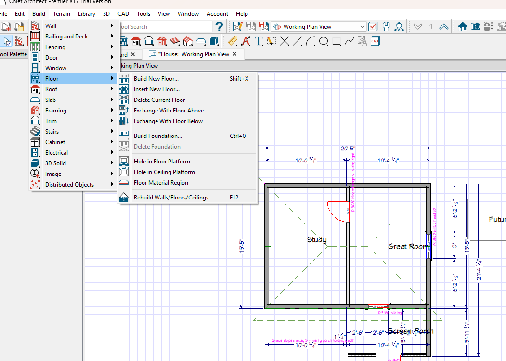
   **Build ▸ Floor ▸ Build New Floor…** → choose **"Derive new 2nd floor
   plan from the 1st floor plan"**, accept the floor defaults dialog
   (Chief's platform build-up; *Finished Ceiling* is the field to true up
   against the level's height if an exact match is wanted):
   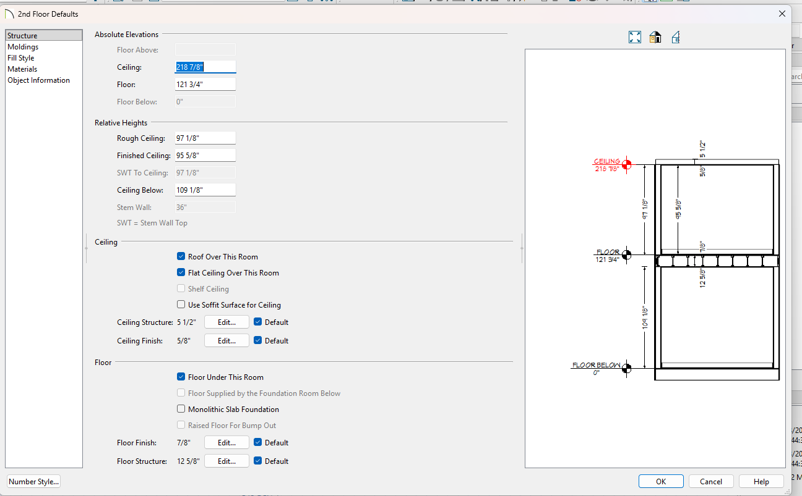

   Delete the derived placeholder walls, then on Floor 2 import that
   level's DXF with **identical settings** and re-run CAD to Walls.
   Because every level shares the FloorPlanner origin, floors stack
   exactly — verify with the Reference Floor toggle:
   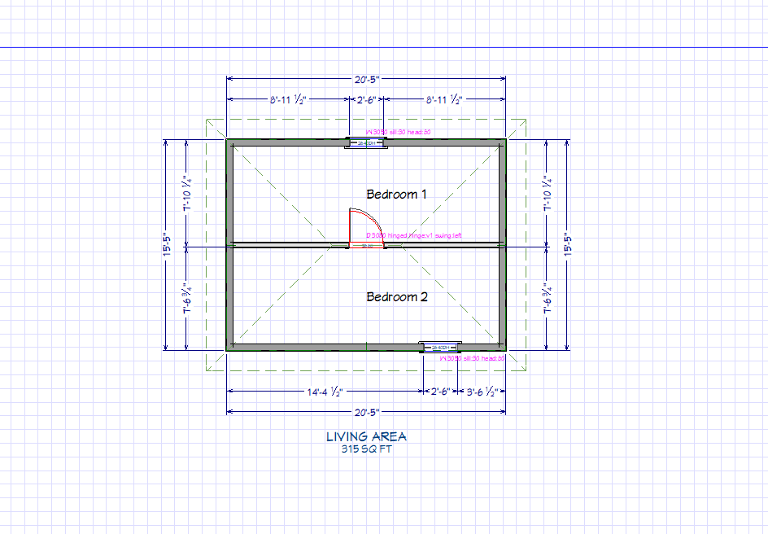
9. **QC and cleanup.**
   1. Apply what Chief can't take from geometry alone: window sill/head,
      slider door type, verify hinge/swing (the magenta `FP-NOTES` tags
      carry the same data on-plan).
   2. Trace **Invisible walls** over `FP-X-OPEN-EDGE` lines to enclose
      open-edged rooms.
   3. **Edit ▸ Delete Objects** → scope All Floors → check the **CAD**
      group but **uncheck Dimensions, Automatic and Dimensions, Manual**
      (those are live Chief objects, not import residue) → Delete.
      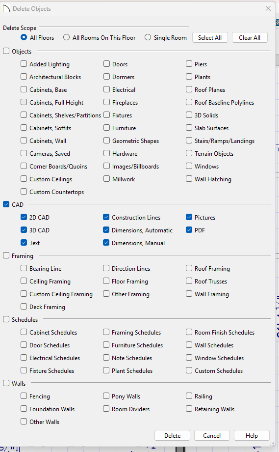

      CAD to Walls *copies* rather than consumes, so this final sweep
      removes the entire imported underlay, leaving a pure native Chief
      model.

### Known limitations

- `cased` / `pass_through` openings ride `FP-DOORS` with a default door
  symbol; convert to Chief's Doorway type during QC (the real kind is in
  the tag/sidecar).
- Wall type carries over only via thickness matching; multi-layer
  assembly definitions are set in Chief per type, once.
- A gate/door with no recorded hinge/swing gets a defaulted handedness
  (`v1`/`left`) purely so it classifies as a door — fix the handedness in
  QC.
- Furnishings, reference images and dimension annotations are not
  exported (deliberate — see above).
- The reverse direction (a Chief-exported DXF → a FloorPlanner design) is
  not implemented; it needs a real Chief-exported DXF sample to tune the
  wall-pairing pass.

The sample design behind the screenshots above, and the DXF/sidecar pair it
produces, are checked in at [`fixtures/chief-export/`](fixtures/chief-export/)
and pinned by `tests/test_fp2dxf.py` — regenerating them without stating why
is a regression, not routine maintenance.

## Asset pipeline

All SVG artwork (toolbar icons, furnishing symbols, `manifest.json`,
`groups.json`) is generated by `_gen_assets.py` — edit it and re-run to
change or extend the library. Every furnishing SVG uses a viewBox in
inches matching its real footprint, which is what makes true-scale
placement work; see `assets/furnishings/README.md` for how to add your
own symbols. `docs/make_gallery.py` rebuilds the hero screenshot above and
the [feature gallery](docs/gallery/), and `examples/make_examples.py`
regenerates the sample files and previews.

## Development

```bash
pip install -r requirements-dev.txt
pytest              # full headless test suite
pytest --quick      # skip the slower gui tests during feature work
ruff check .        # lint
```

Tests live in `tests/` (see `tests/README.md`); they run headless via Qt's
offscreen platform. Categories are tagged with markers so subsets can be
run or skipped, e.g. `pytest -m "not gui"`.

## Licenses

- Application code: MIT License — free to use, copy, modify, and
  distribute; just keep the credit notice. Created by Patrick Moran with
  Claude (Anthropic). See `LICENSE`.
- Furnishing symbols and toolbar icons: CC0 1.0 (drawn for this project,
  see `assets/furnishings/LICENSE`)
- DejaVu fonts: see `assets/fonts/LICENSE`
- PyQt6 (the GUI toolkit this app depends on): dual-licensed under the
  GPL v3 and a commercial license from Riverbank Computing. See
  [PyQt6 licensing](https://www.riverbankcomputing.com/commercial/license-faq)
  and the [GPL v3 text](https://www.gnu.org/licenses/gpl-3.0.html).
