# Feature gallery

Each image highlights one feature.  All are regenerated from a single demo
plan by `python docs/make_gallery.py` — don't hand-edit the PNGs.

### Overview
The whole plan at a glance — walls, rooms, furnishings and the toolbar
**Totals** (cost / sq ft).

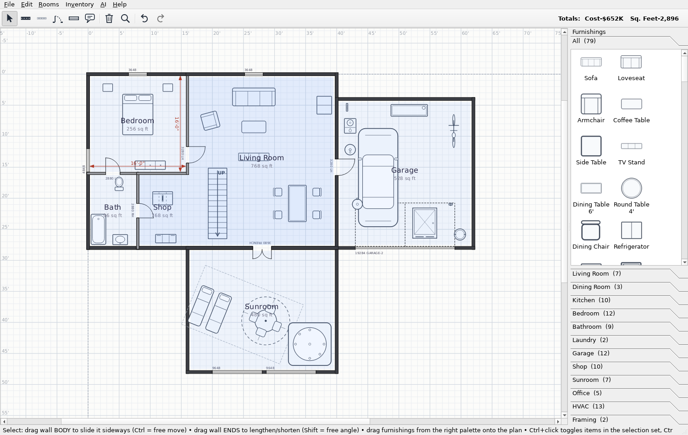

### Furnishings at true scale
A bundled CC0 library of 70 top-view symbols; drag from the right-hand
palette and each lands at its real footprint.

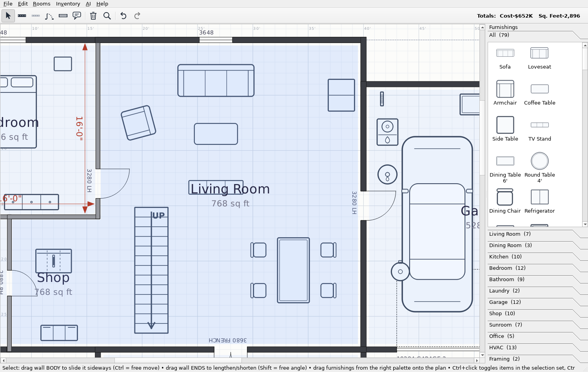

### Doors & windows
WWHH-sized openings that cut the wall and ride it when dragged, including
single/double garage doors with a dashed overhead outline.

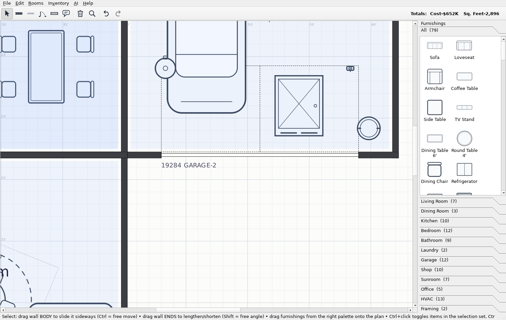

### Rooms
Click an enclosed area to name it; the room computes its true area and can
draw dimension arrows on every wall.

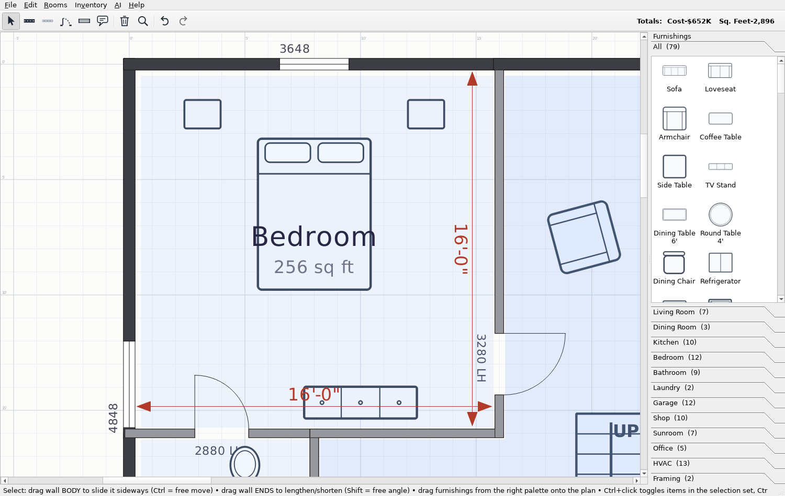

### Stairs (Framing)
A dynamic stair whose step count comes from the room's ceiling height, with
an UP / DN travel arrow; full or half flights.

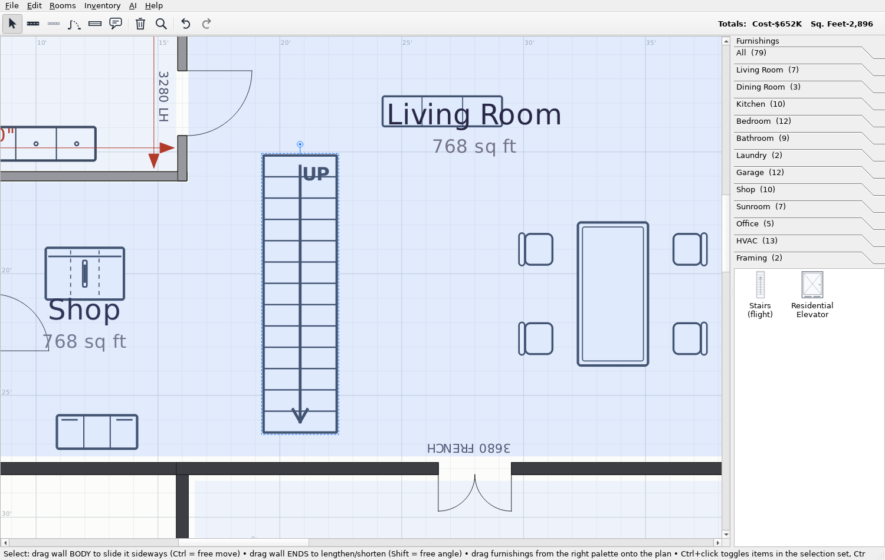

### Groups & rotation
Group items and move/rotate them as one — the selection box and rotation
handle orient with the group.

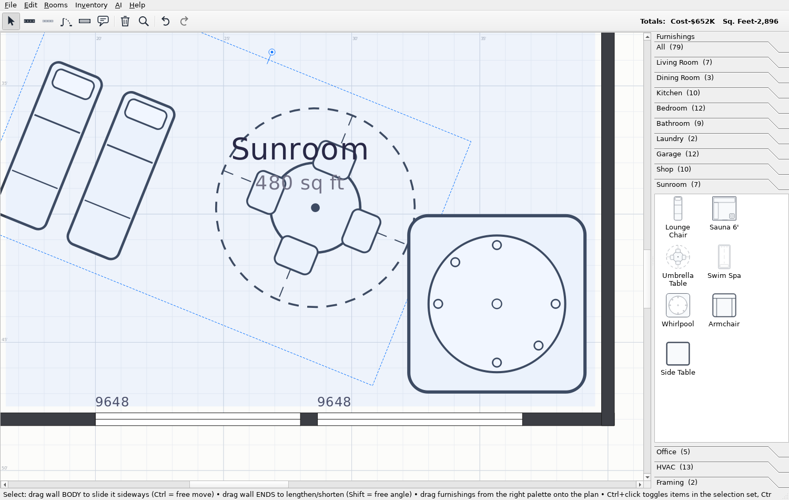

### HVAC equipment
Furnaces, water heaters, panels, well pump, car charger and more.

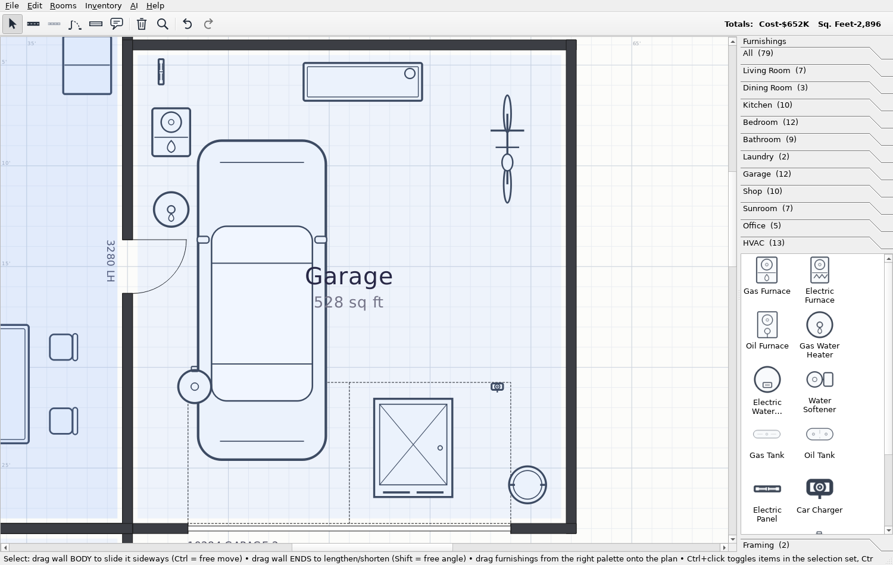

### Rooms own their walls — and can be left partly open
Detach a wall to unlock its corners; pull a corner away and that side
**opens** (dashed), so a room needn't be walled on every side.

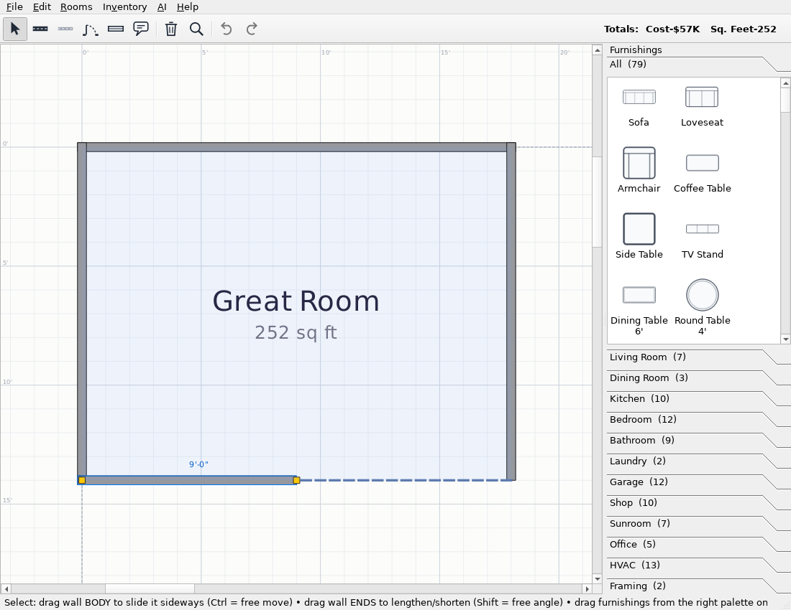

### A clean door between rooms
Adjacent rooms each own their own wall on the shared boundary; a door
belongs to one of them and the coincident wall **opens** for it — a single
door, never two stacked on top of each other.

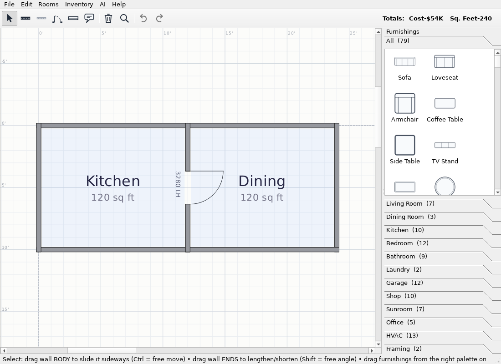

### Bathroom fixtures
A master bath with both luxury walk-in showers — a floor-to-ceiling **glass
walk-in shower** (5' × 4') and a tiled walk-in shower with a bench — plus a
toilet and a **double-vanity base**, all at true scale. Standard kitchen and
bath **base cabinets** (door bases, drawer base, sink base, corner
lazy-susan, vanity bases) are in the Kitchen and Bathroom palette sections.

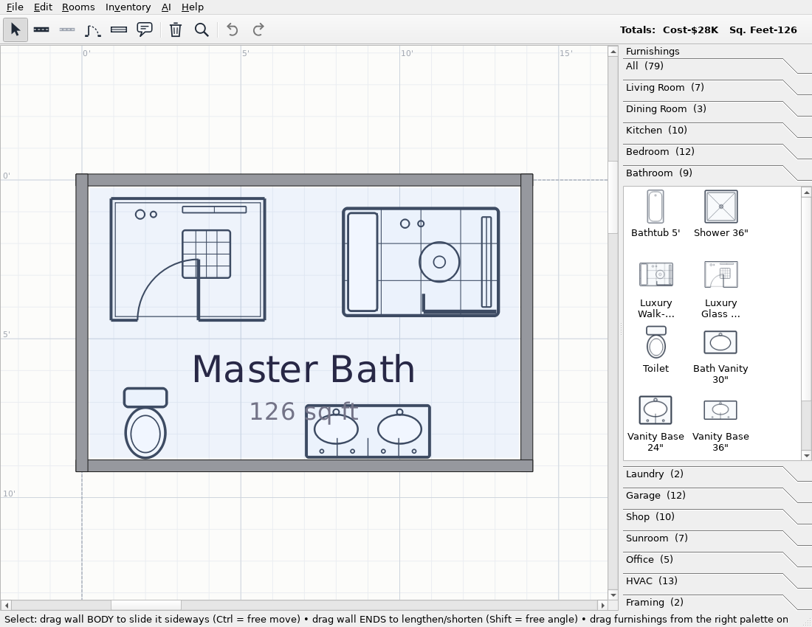

### Inventories (Excel-ready)
House / Interior / Yard / Total tables; **Copy to clipboard (TSV)** pastes
straight into a spreadsheet.

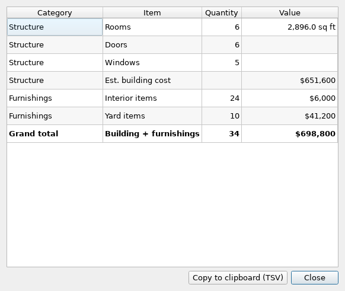

### AI furnishing pricing
The **AI** menu fetches current purchase prices for the whole catalog from a
chosen AI system via an editable prompt.

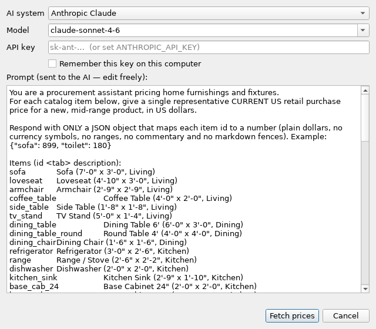

### Help ▸ About
Where the app keeps your designs and settings, using OS-standard locations.

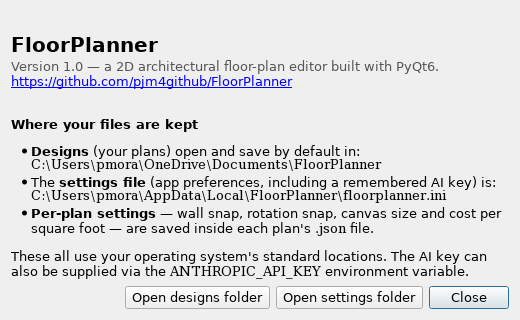
