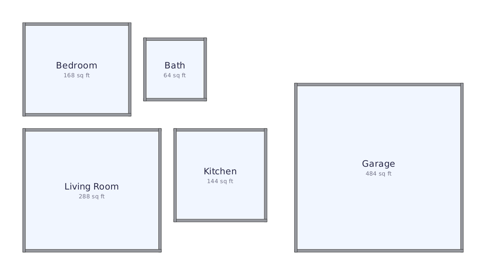
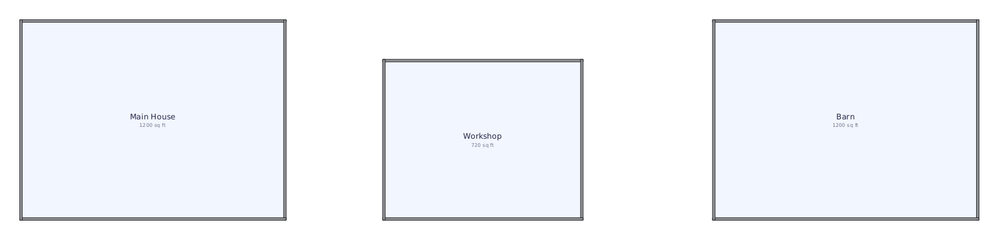
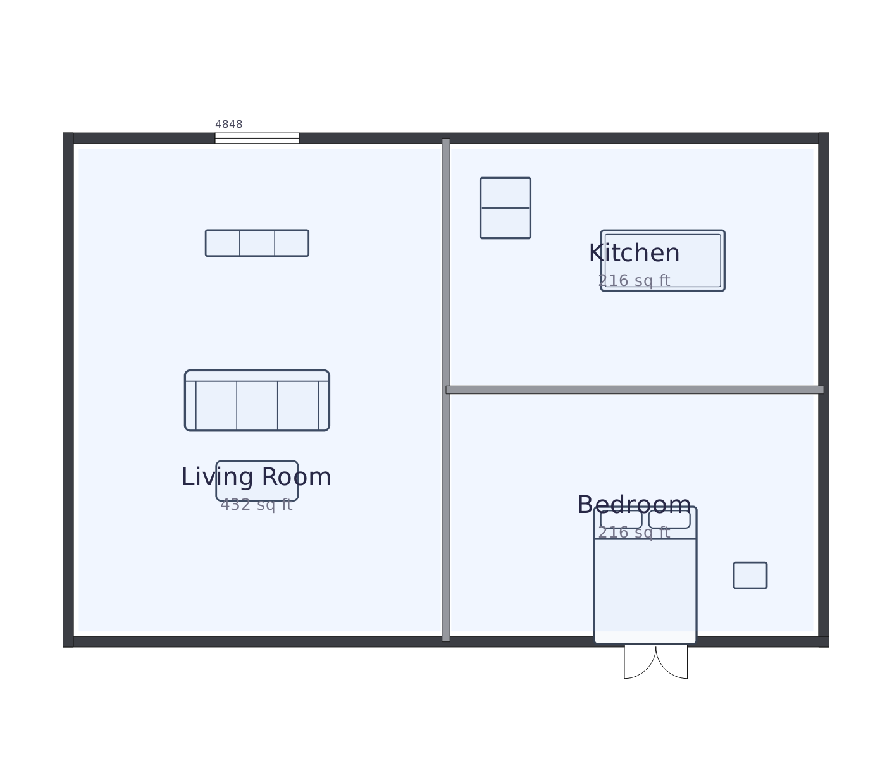

# Examples

Sample files for the two import formats, plus rendered previews. Regenerate
everything with:

```
python examples/make_examples.py
```

## Room CSV import (`File > Import rooms from CSV…`)

Columns: `Name,Type,X_ft,Y_ft,X_loc_ft,Y_loc_ft,Notes`

- `X_ft` / `Y_ft` — the room's width and length (feet). Accepts `12`, `12.5`, `12'6"`, `12'-6"`.
- `X_loc_ft` / `Y_loc_ft` — optional; the room's **bottom-left corner**, in feet from the canvas's bottom-left. Give both or neither; rooms with no location auto-place on the first clear spot.
- `Type` / `Notes` — optional.

| File | What it shows |
|------|---------------|
| [`simple_house.csv`](simple_house.csv) | Five located rooms that fit the default 100'×70' canvas. |
| [`large_site.csv`](large_site.csv) | A `Barn` placed at X_loc 110' — past the default canvas, so the canvas **grows to 152'** to contain it. |





The canvas only ever **grows** to fit imported rooms (never shrinks), up to a
500' cap. A room whose size or location needs more than that is rejected as a
likely typo and reported in the import summary.

## Native plan JSON (`File > Open` / `Save`)

[`sample_plan.json`](sample_plan.json) is a full plan: a 36'×24' shell split
into Living Room / Kitchen / Bedroom, with a French door, a window, and
furnishings placed at true scale. This is the format the app reads and writes.


